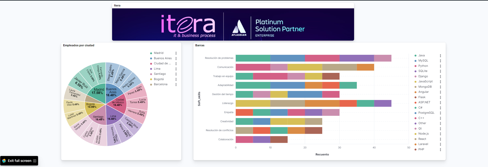
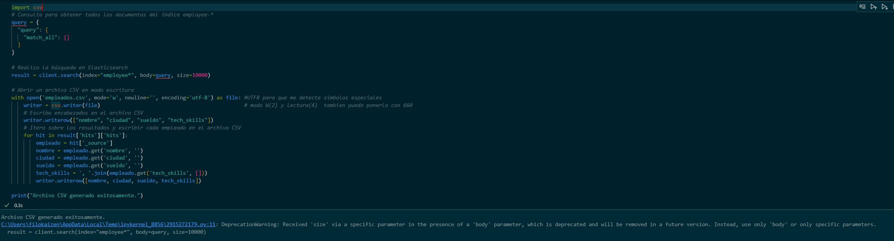

# Prueba técnica Itera

## Descripción
Este proyecto tiene como objetivo demostar mis habilidades informáticas y demostrar la capacidad de auto aprender. Para realizar la prueba técnica, utilicé varios recursos videos de Youtube, Stack overflow, Platzi, leer la documentación de Elastic.

Los ejercicios que se plantearon fueron 4. 

1. Creación de un indice 
   
    Dese la plataforma de Elastic, se creo y se configuró una API para poder conectarme a ella a través de VS programando en Python. Una vez verificado que se existe dicha conexión por medio del código client.info(). Se procedió a crear un índice en formato JSON

    
    

2. Búsquedas en el Índice
    Una vez creado el índice employee se realizó consultas por medio de la API para obtener las siguientes consultas:

    Buscar todos los empleados que superen los 30 años.
    Buscar todos los empleados menores o iguales a 30 años que tienen un sueldo mayor a los 50 mil pesos.
    

3. Creación de Tablero en Kibana
   
    Se aprendió a usar Kibana, una interfaz que permite visualizar datos.  Realice 2 graficos el de la izquierda correspone a un gráfico circular/ pie que representa el porcentaje de trabajadores por Ciudad.

    El gráfico de la derecha se decidió usar un gráfico de barras apilado, ya que queremos conservar tanto la información general(el recuento de las soft skills) como la información específica(las hard skills)

    Debido a la ausencia de un campo con el nombre de la compaía de cada empleado, se inserto en la parte superior una imagen de nuestra empresa. 

    

4. Generación de Archivo CSV con Logstash
   
    Por último creo un archivo csv que lee del índice employee, el cual le doy permisos de escrito y de lectura. Creo un bucle for para obtener el nombre, la ciudad, el sueldo y las tech skills de los empleados. 
    